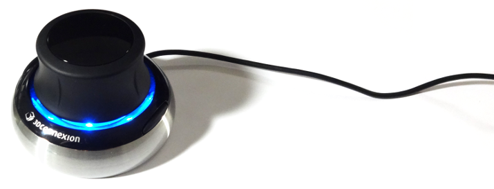

# io-spacenav
Nim bindings for libspnav, the free 3Dconnexion device driver

## About
io-spacenav is a module with bindings to the Spacenav SDK (libspnav) for the Nim
programming language. Spacenav provides a free, compatible and open source
alternative for 3Dconnexion's popular 3D input device drivers and SDK.

## Supported Devices & Platforms
The latest version of this module has been tested with **spacenavd 0.6**
and **libspnav 0.2.3**, which currently support the following devices:

- All USB 3Dconnexion 6DOF devices (Linux)
- All serial Spaceball devices (Linux, FreeBSD, MacOSX)

Support for USB devices under Windows and MacOSX is underway, but incomplete.

Out of the platforms officially supported by Spacenav, the following have been
implemented and tested with this module:

- ~~FreeBSD~~
- Linux
- ~~MacOSX~~

Please note that there is currently no single library that supports all of
FreeBSD, Linux, MacOSX and Windows. If you wish to use USB based 3Dconnexion
devices in Nim under MacOSX or Windows, please consider using the
[io-3dxware](https://github.com/nimious/io-3dxware) bindings instead!

## Prerequisites
To compile the bindings in this module, you need to have **libspnav**, the
Spacenav SDK library, installed on your computer. Users of your program also
need to install and run **spacenavd**, the Spacenav Daemon, that implements the
actual device driver for 3Dconnexion input devices.

### Linux
If your Linux distribution includes a package manager or community repository,
it may already have pre-compiled binaries for both the Daemon and the SDK. For
example, on ArchLinux the SDK is available in the official repository:

`sudo pacman -Sy libspnav`

The daemon is available in AUR:

`yaourt spacenavd`

Make sure to verify the available version numbers as they may be very outdated.
It is then preferable to follow the instructions in the Spacenav sourceforge
repository to manually build the daemon and SDK from source.

### MacOSX

TODO

### FreeBSD

TODO

### Windows

TODO

# Usage

TODO

# References

* [Spacenav web site](http://spacenav.sourceforge.net/)
* [Spacenav on sourceforge](http://sourceforge.net/projects/spacenav/)
* [3Dconnexion web site](http://www.3dconnexion.com/i)